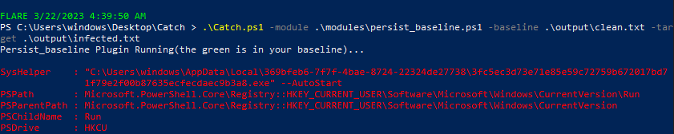

# Corners

## Overview

Corners is a powershell script that relaies on Many techniques from `MITRE ATT&CK` to Collect Persistet executables in the windows machine.

`Also` the baseline tool included can compare two shoots from the tool to get you just the change in the state from persistence prespective(behavioral analysis). 

## Features

- Cover many persistence techniques.
- Compare two shoots and get you just the change(Baselining).
- Map each output from the tool to a specific mitre technique number(quick research).

## Example usages 

You can use the tool in suspected machine in your environment or hunting unknown malwares by quickly identifing deviation from a base line.

You can use the tool in your behavioural analysis (malware analysis) to quicly identify persistence mechanism.

